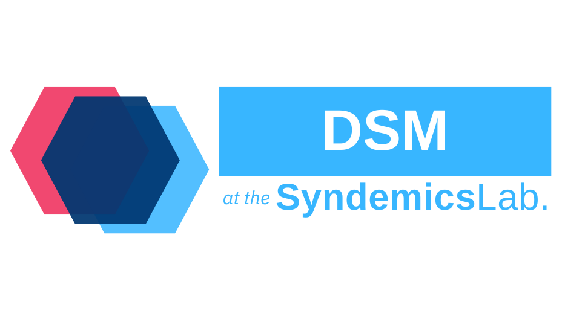

# DataManagement for the Syndemics Lab at Boston Medical Center

[](https://www.gnu.org/licenses/agpl-3.0)  

## About DataManagement

This repository contains the primary interface for managing all data sources for models developed and maintained at the Syndemics Lab at Boston Medical Center. Currently, all sources are either a CSV file, Database File (SQLite), or an `ini` structured configuration file. For more information please see the examples below.

### License

Copyright 2024-2025, Syndemics Lab, All rights reserved.

Distributed under the AGPLv3 license.

Any questions, please reach out to [Jocelyn Vititow](jocelyn.vititow@bmc.org) or [Caroline Savitzky](caroline.savitzky@bmc.org).

#### Note On Redistribution

While licensed under the AGPLv3 License for fair use, we would appreciate a mention or link to the repository in any publications.

### Supported Platforms

As we make use of the std::filesystem library, we require a C++20 compiler. To build with CMake we require a CMake Version >= 3.20.

Development was done with:

- Ubuntu 22.04
- Github Actions

IDEs and Compilers used:

- GCC 11.4.0
- VSCode
- Emacs

### Dependencies

- C++20 STL Implementation
- CMake >= 3.20
- [Eigen](https://eigen.tuxfamily.org/) - For Matrix based operations with data
- [spdlog](https://github.com/gabime/spdlog) - For logging info, warnings, and errors
- [SQLiteCpp](https://github.com/SRombauts/SQLiteCpp) - For easy C++ styled manipulation of SQLite, rather than using the C-styled SQLite native API
- [Boost Property Tree](https://www.boost.org/doc/libs/1_81_0/doc/html/property_tree.html) - For reading the `ini` styled config files and parsing them into human usable inputs
- [GoogleTest/GTest](https://github.com/google/googletest) (optional) - For building and running unit tests

## Getting Started

### Installation

To use this tool, we recommend installing the project locally and then incorporating it with the CMake `find_package()` functionality.

Example Installation for Linux:

```bash
git clone git@github.com:SyndemicsLab/DataManagement.git
cd DataManagement
mkdir build && cd $_
cmake .. -DCMAKE_BUILD_TYPE=Release
cmake --build . --target install --config Release
```

If installed system wide, a `DataManagementConfig.cmake` file will be generated and installed. This allows for use with any CMake project avaliable.

Example Use in `CMakeLists.txt`:

```cmake
find_package(datamanagement REQUIRED)
# Here you create your targets necessary
target_link_libraries(my_target PRIVATE datamanagement::datamanagement)
```

### Testing

To run the tests, simply compile with the CMake `BUILD_TESTS` flag enabled and ensure you include `googletest` from the dependency list.

```bash
git clone git@github.com:SyndemicsLab/DataManagement.git
cd DataManagement
mkdir build && cd $_
cmake .. -DCMAKE_BUILD_TYPE=Debug -DBUILD_TESTS=ON
cmake --build . 
./tests/dataTests
```

## Data Types

### Tabular Data

Tabular data is handled in a DataTable object. DataTables are made up of rows and columns. DataTable has a constructor intended to handle Comma-Separated-Value (CSV) files. There is future plans to also implement a way to read from an SQL Table into a DataTable object.

### Configuration Data

Configuration file data is read via the Configuration object. It parses an expected ini file making use of the boost property tree and allows for optional parameters and a way to parse apart strings into vectors.

## Examples

### Config

First, an example of the file structure is shown below:

```cpp
// Example Config File Layout
std::ofstream file("test.conf");
file << "[simulation]" << std::endl;
file << "duration = 52" << std::endl;
file << "aging_interval = 260" << std::endl;
file << "[state]" << std::endl;
file << "ouds = Active_Noninjection, Active_Injection, "
        "Nonactive_Noninjection, Nonactive_Injection"
        << std::endl;
file.close();
```

To use the config object, simply create the object and call the get method:

```cpp
#include <datamanagement/source/Config.hpp>

datamanagement::source::Config config("test.conf");
std::string data = "";
config.GetFromConfig("simulation.duration", data);
// data now contains the value "52"
```

We also have the ability to get the categories for each section in an `ini` config file:

```cpp
std::vector<std::string> data = {};
config.GetConfigSectionCategories("simulation", data);
// data now contains {"duration", "aging_interval"}
```

### CSV Sources

An example CSV is shown:

```cpp
std::ofstream file("test.csv");
file << "id,name,age\n";
file << "1,Alice,30\n";
file << "2,Bob,25\n";
file << "3,Charlie,35\n";
file.close();
```

Data is retrieved in an `Eigen::MatrixXd` format and requires specifying columns and optional where conditions.

```cpp
Eigen::MatrixXd filtered_data = csv_source.GetData({"id", "age"}, {{"name", "Alice"}});
// the matrix contains the values: {1, 30}
```

### DB Sources

Setting up the Database File:

```cpp
SQLite::Database db("test.db",
                            SQLite::OPEN_READWRITE | SQLite::OPEN_CREATE);
db.exec("CREATE TABLE IF NOT EXISTS test (id INTEGER PRIMARY KEY, name "
        "TEXT, age INTEGER);");
SQLite::Transaction transaction(db);
db.exec("INSERT INTO test (name, age) VALUES ('Alice', 30);");
db.exec("INSERT INTO test (name, age) VALUES ('Bob', 25);");
db.exec("INSERT INTO test (name, age) VALUES ('Charlie', 35);");
transaction.commit();
```

To Select Data from the Database:

```cpp
#include <datamanagement/source/DBSource.hpp>

datamanagement::source::DBSource db_source("test.db");
std::any storage = std::vector<std::tuple<int, std::string, int>>{};

std::unordered_map<int, datamanagement::source::BindingVariant> bindings;
bindings[1] = 1;
db_source.Select(
    "SELECT * FROM test WHERE id = ?;",
    [](std::any &storage, const SQLite::Statement &stmt) {
        std::vector<std::tuple<int, std::string, int>> *results =
            std::any_cast<std::vector<std::tuple<int, std::string, int>>>(
                &storage);
        results->emplace_back(stmt.getColumn(0).getInt(),
                                stmt.getColumn(1).getText(),
                                stmt.getColumn(2).getInt());
    },
    storage, bindings);

std::vector<std::tuple<int, std::string, int>> results =
    std::any_cast<std::vector<std::tuple<int, std::string, int>>>(storage);
/// The results vector ends up with {(1, "Alice", 30)}
```

For Batch Execution of Inserts/Creations/Deletions:

```cpp
datamanagement::source::DBSource db_source("test.db");
std::string query = "INSERT INTO test (name, age) VALUES (?, ?);";
std::vector<std::unordered_map<int, datamanagement::source::BindingVariant>>
    batch_bindings;
for (int i = 0; i < 10; ++i) {
    std::unordered_map<int, datamanagement::source::BindingVariant>
        bindings;
    bindings[1] = i;
    bindings[2] = "Test" + std::to_string(i);
    batch_bindings.emplace_back(bindings);
}
db_source.BatchExecute(query, batch_bindings);
```

## How to Contribute

Currently, this work is supported and under active development by the Syndemics Lab team. Open contributions are welcome but accepted on a very limited basis as this is a functional underpinning for our team's private models. If there are issues or requests please fill out a new issue and we'll respond as soon as possible.
